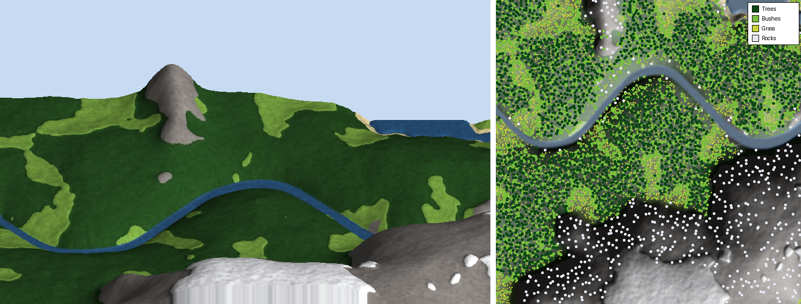

# effective-tribble

**House model:** see [`house/`](house/README.md) for the Blender model of the house and front yard, which exports to a walkable Unreal scene with swappable plants.

## Picture → Unreal Engine landscape

Turn a picture into a 3D landscape you can import into **Unreal Engine 5**, with
all the plants placed as **swappable Foliage Types** so you can change the trees,
bushes, grass and rocks to whatever meshes you like.



*Above: `examples/sample_aerial.jpg` → terrain (left) and where plants were
placed (right).*

## What kind of picture works

| Picture | Mode | Result |
|---|---|---|
| Aerial / satellite / drone shot looking **straight down**, or a painted/drawn top-down map | `topdown` (default) | Terrain shape is estimated from what's on the ground (water low, meadows, forest, rock and snow higher) and plants follow the colours in the picture. |
| A grayscale **heightmap / DEM** (8- or 16-bit PNG/TIF) | `heightmap` | Exact elevation from the image; ground layers and plants are chosen by height and slope. |
| Top-down photo where you want AI depth estimation | `depth` | Uses the Depth-Anything-V2 model (needs `torch` + `transformers`). |

A normal eye-level photo (horizon in the shot) can't be turned directly into a
top-down map. For those, the best route is to find a satellite/map view of the
place, or paint a rough top-down map in the photo's colours.

## 1. Generate the landscape kit

```bash
pip install -r requirements.txt
python image_to_landscape.py input/my_picture.jpg
```

Output goes to `output/my_picture/`:

| File | Used for |
|---|---|
| `heightmap.png` | 16-bit heightmap → Landscape import |
| `layers/Grass.png, Forest.png, Dirt.png, Rock.png, Sand.png, Snow.png` | paint-layer weightmaps (each pixel sums to 255) |
| `foliage_points.csv` | every plant/rock instance: position, rotation, scale |
| `foliage_config.json` | **which mesh each plant category uses — edit this to swap plants** |
| `import_foliage.py` | the Unreal Editor script that places the plants |
| `albedo.png` | the picture itself, fitted to the landscape (quick colour map) |
| `foliage/*.png` | density masks per category (handy for PCG / Landscape Grass) |
| `water_mask.png` | where the picture had water (for the Water plugin) |
| `manifest.json` | **the exact Unreal import settings** (scale, section size) |
| `preview.png` | quick look at the result |

Useful options:

```
--size 1009            landscape resolution: 505, 1009 (≈1 km), 2017 (≈2 km) ...
--world-size 2000      landscape width in metres (default 1 m per vertex)
--height-range 300     metres from lowest to highest point (default 150)
--relief 1.5           add more hills than the picture shows (0–3)
--smooth 2             smoother terrain
--foliage-density 0.5  half as many plants
--foliage-spacing 2    plants spread twice as far apart
--mode heightmap       input is already a heightmap
--obj                  also write landscape.obj (Blender etc.)
--seed 42              different random plant layout
```

## 2. Import the terrain into Unreal (UE 5.x)

1. **Landscape mode** (`Shift+2`) → **Manage** → **New** → **Import from File**.
2. **Heightmap File**: `heightmap.png`.
3. **Scale X / Y / Z**: copy `landscape_scale` from `manifest.json`
   (e.g. `100, 100, 29.2969`). Use the **Section Size** / **Sections Per
   Component** listed there too; the resolution should fill in automatically.
4. *(optional, recommended)* **Material**: pick a landscape material with layers
   named `Grass, Forest, Dirt, Rock, Sand, Snow` (see below). The layer list
   then appears in the import panel — for each layer click **+** →
   *Weight-Blended Layer*, then set its file to `layers/<Name>.png`.
5. Click **Import**.

### Landscape material

*Quickest:* make a material using `albedo.png` as its colour, with a
**LandscapeLayerCoords** node (Mapping Scale = the landscape resolution minus
one, e.g. `504` for 505) plugged into the texture's UVs. That drapes the original
picture over the terrain.

*Proper:* make a material with a **LandscapeLayerBlend** node containing the six
layers `Grass, Forest, Dirt, Rock, Sand, Snow` (Weight Blend), each fed with your
own ground textures. The imported weightmaps paint them where the picture showed
them, and you can keep painting by hand in Landscape mode.

## 3. Place the plants

1. Enable **Python Editor Script Plugin** (Edit → Plugins), restart the editor.
2. **Tools → Execute Python Script…** (older versions: File → Execute Python
   Script) and choose `output/my_picture/import_foliage.py`.

It finds your Landscape, lines everything up with it and creates Foliage Type
assets in `/Game/ImageLandscape/Foliage/` (`FT_Trees_0`, `FT_Bushes_0`,
`FT_Grass_0`, `FT_Rocks_0`). The plants are ordinary foliage, so they show up
in **Foliage mode** (`Shift+3`) where you can paint or erase more.

Out of the box they use Unreal's built-in placeholder shapes (cones for trees,
spheres for bushes, etc.) so it works in any project.

## 4. Swap the plants

**Option A — in Unreal (fastest):** open e.g. `FT_Trees_0` in
`/Game/ImageLandscape/Foliage/`, change **Mesh** to your tree. Every tree on the
landscape updates instantly. Or in Foliage mode, right-click a foliage type →
*Replace Foliage Type*.

**Option B — mix several plants per category:** edit `foliage_config.json`:

```json
"Trees": {
  "meshes": [
    "/Game/MyPlants/SM_Pine_A.SM_Pine_A",
    "/Game/MyPlants/SM_Pine_B.SM_Pine_B",
    "/Game/MyPlants/SM_Birch.SM_Birch"
  ],
  "scale_multiplier": 1.0,
  "mesh_pivot_offset_cm": 0,
  ...
}
```

(Right-click a mesh in the Content Browser → **Copy Reference** to get its path.)
The points are split randomly between the listed meshes. Then run
`import_foliage.py` again — it replaces what it placed last time and keeps the
same layout. Set `"enabled": false` to leave a category out.

When you switch from the placeholders to real plant meshes, set
`scale_multiplier` to `1` and `mesh_pivot_offset_cm` to `0` (real plants have
their pivot at the base; the placeholder shapes have it in the middle).

## Try it with the sample

```bash
python image_to_landscape.py examples/sample_aerial.jpg --size 505
```

A pre-generated result is in `examples/sample_output/`.

## Notes

- Unreal's recommended landscape sizes (505, 1009, 2017, 4033 …) are used so
  the terrain fits whole components with no padding.
- Everything is deterministic for a given `--seed`, so regenerating gives the
  same plant layout.
- `foliage_config.json` is never overwritten on regeneration, so your plant
  choices survive re-running the generator.
- The Unreal script was written against UE 5.1+ Python APIs. On versions that
  can't add foliage from Python it falls back to one actor per category with a
  Hierarchical Instanced Static Mesh component (swap the mesh on that component).
