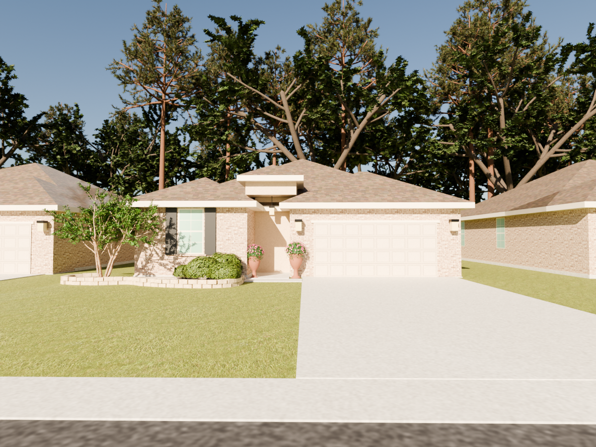
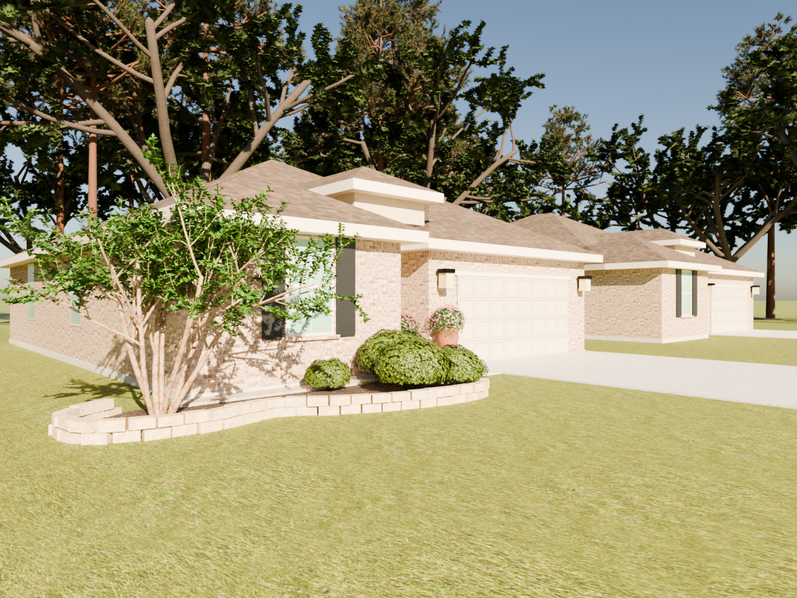
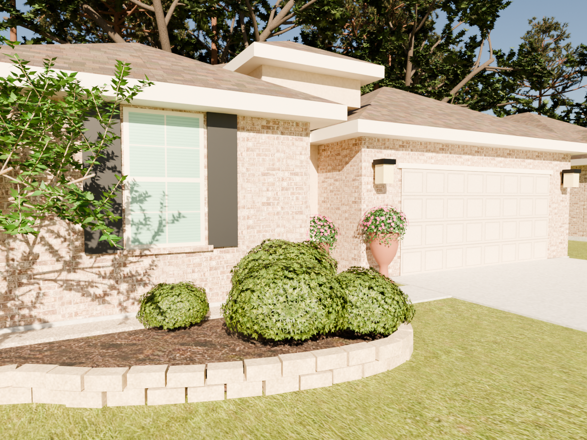
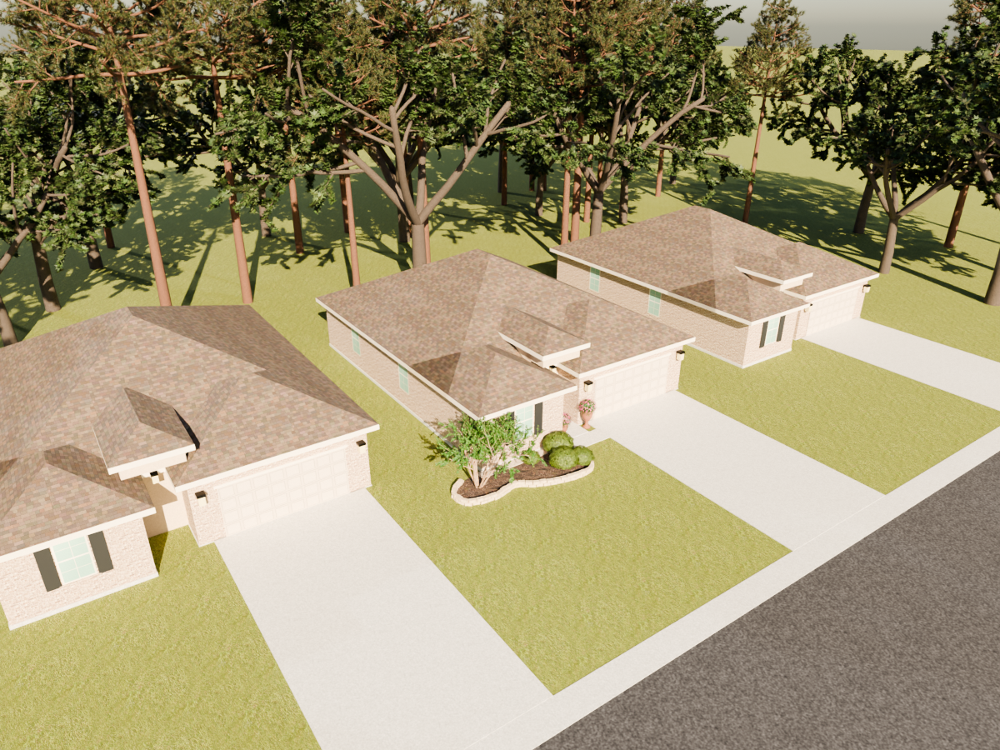
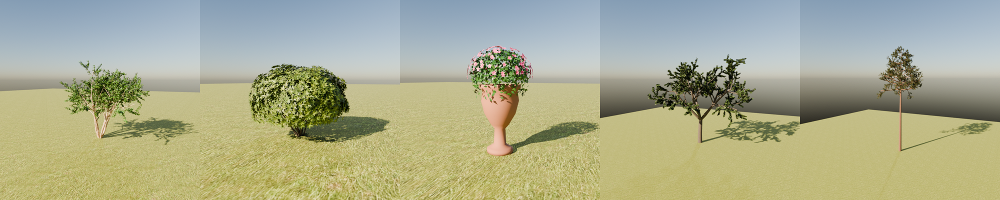

# My House — Blender model → walkable Unreal scene

A 3D model of the house and front yard, built in Blender from four photos, ready
to walk around in Unreal Engine 5. Every plant is a separate object, so you can
swap it for any other plant.

| Front (compare with photo 3) | Left corner (photo 1) |
|---|---|
|  |  |
| **Entry / flower bed (photos 2 and 4)** | **Aerial** |
|  |  |

## What's modelled

- **House:** brick walls, the stucco entry with its raised roof, hip roofs with
  cream fascia and soffits, the front window with black shutters, the black front
  door with transom, the 2-car raised-panel garage door, carriage lanterns, the
  entry pendant, and side and back windows so it works from all 360°.
- **Yard:** lawn, driveway, porch and walk, curb and street, the kidney-shaped
  mulch bed, the river-rock strip along the foundation, and two courses of
  tumbled stone edging.
- **Plants** (each one can be swapped):
  - `Plant_CrapeMyrtle_01`: the multi-trunk tree at the left corner
  - `Plant_Azalea_01…04`: the shrubs in the bed
  - `Plant_UrnFlowers_01/02`: the two urns with the pink flowers
  - `Plant_LiveOak_*` and `Plant_Pine_*`: the woods behind the house
- **Neighbours:** simple copies of the house on either side for context. Delete
  the *Neighbours* collection or folder if you don't want them.

The measurements are estimates taken from the photos, using the 16 ft (4.9 m)
2-car garage door as the scale reference. The back and sides weren't
photographed, so they are an educated guess at a typical plan for this house
style.

### Plants: full geometry, built for Nanite



Every leaf, pine needle and petal is modelled as real geometry. Nothing uses
see-through leaf cards. The leaves are opaque and double-sided, which is the
setup Unreal's **Nanite** renders best: Nanite streams millions of triangles
cheaply, but it's slow with see-through ("masked") leaf materials.

| Plant | Leaves | Triangles |
|---|---|---|
| Crape myrtle: 7 trunks with mottled bark | 27k | 166k |
| Azalea: dense mound, leaves in rosettes | 22k | 89k |
| Urn: 40-sided terracotta urn, vinca leaves, 170 magenta flowers | 1.4k | 10k |
| Hardwood (water/live oak) | 75k | 370k |
| Loblolly pine: needle bundles | 14.5k tufts | 341k |

Each leaf picks its colour from a small palette texture, matched to the
photos, and shades from darker at the stem to lighter at the tip. The
generators are in `house/plants.py`. Change the numbers there (leaf size and
spacing, branch counts and angles) and rerun the build to make new variations.

## Files

```
house/
  build_house.py        Blender script that builds everything (edit dimensions at the top)
  plants.py             the geometric plant generators
  make_textures.py      makes the textures from the photos (already done)
  textures/             brick, shingles, lawn, mulch, leaves, doors, window...
  unreal/import_house.py
  output/
    MyHouse.blend       open in Blender 4.2+
    MyHouse_Full.fbx    whole scene in one FBX
    unreal/             <- the folder you use for Unreal
      meshes/SM_*.fbx   one mesh per file, textures embedded
      placements.json   where everything goes
      plant_swaps.json  bulk plant swapping
      import_house.py   the Unreal script
    renders/            the preview pictures above
```

## Open it in Blender

Open `house/output/MyHouse.blend`. The scene has **House**, **Yard**, **Plants**
and **Neighbours** collections.

**To swap a plant in Blender:** import your plant (File → Import), select one of
the `Plant_…` objects, go to **Object Data Properties** (green triangle icon), and
pick your plant's mesh from the dropdown. All copies of a type share one mesh,
so changing the mesh inside `SM_Plant_Azalea` changes every azalea.

To rebuild after changing anything in the script:

```bash
blender -b -P house/build_house.py            # or: pip install bpy==4.2.0 && python house/build_house.py
blender -b -P house/build_house.py -- --no-render   # skip the preview renders (fast)
blender -b -P house/build_house.py -- --plants      # render each plant on its own
blender -b -P house/build_house.py -- --glb         # also export MyHouse_Full.glb
```

## Walk around it in Unreal Engine 5

1. Create a new project from **Games → Third Person** (so you have a character
   that walks), then **File → New Level → Basic** (sky, sun and fog are
   included). Delete the level's default floor plane.
2. **Edit → Plugins**, enable **Python Editor Script Plugin**, and restart.
3. Open **Window → Output Log**. In the command box at the bottom, click
   **Cmd** and switch it to **Python**. Paste this line and press **Enter**:

   ```python
   import urllib.request as r; exec(r.urlopen("https://raw.githubusercontent.com/distempered1-rgb/effective-tribble/refs/heads/claude/3d-landscape-unreal-engine-yw7zzp/house/unreal/import_house.py").read().decode())
   ```

   You don't need to download or unzip anything. The script:
   - pulls the model straight from GitHub into `<YourProject>/Saved/MyHouse`;
   - imports it into `Content/MyHouse/Meshes`;
   - places everything in the Outliner under **MyHouse/House**, **Yard**,
     **Plants** and **Neighbour**;
   - turns on **Nanite** for every mesh, with "Preserve Area" on the plants
     so leaves don't thin out at a distance;
   - gives everything per-polygon collision, so you can walk up to the walls,
     onto the porch and under the trees;
   - adds a **Player Start** on the driveway.

   Progress and any errors appear in the Output Log as lines starting with
   `[MyHouse]`.
4. Press **Play**. Walk around with WASD and the mouse.

*Offline alternative:* download the repo, then use **Tools → Execute Python
Script…** on `house/output/unreal/import_house.py`. It uses the files next to
it instead of downloading.

*No-script alternative:* **File → Import Into Level →
`MyHouse_Full.fbx`** brings in the whole scene as separate actors. In the
import options tick **Build Nanite** (under Mesh). You may need to set collision
to "Use Complex Collision As Simple" on the meshes yourself.

### Swap plants in Unreal

- **One plant:** click it in the viewport (or the Outliner under
  MyHouse/Plants). In **Details**, set **Static Mesh** to your plant. Quixel
  Megascans (free in Fab) and the Fab marketplace have realistic crape myrtles,
  azaleas, boxwoods and more.
- **All plants of a type:** in the Content Browser, right-click your plant mesh
  → **Copy Reference**. Paste it into `plant_swaps.json`:

  ```json
  "by_type": {
    "SM_Plant_Azalea": "/Game/Megascans/3D_Plants/Azalea/SM_Azalea_01.SM_Azalea_01",
    "SM_Plant_CrapeMyrtle": ""
  },
  "by_object": {
    "Plant_Azalea_03": "/Game/MyPlants/SM_Boxwood.SM_Boxwood"
  }
  ```

  The swaps file is at `<YourProject>/Saved/MyHouse/plant_swaps.json`. After
  editing it, paste the same line again. It removes what it placed last time
  and rebuilds everything with your plants in the same spots. It never
  overwrites your swaps file.
- **Add or move plants:** just drag the actors around, or duplicate with
  Alt-drag. Foliage mode (Shift+3) works too for painting ground cover.

## Adjusting the model

All dimensions are at the top of `build_house.py` (`WING`, `ENTRY`, `GARAGE`,
`BODY`, `WALL_H`, `PITCH`), with the flower-bed outline in `BED` and every
plant's position in `PLANTS`. Measure your house (garage width, how far the
bedroom wing sticks out, window position), put the real numbers in, and rerun
the script.
